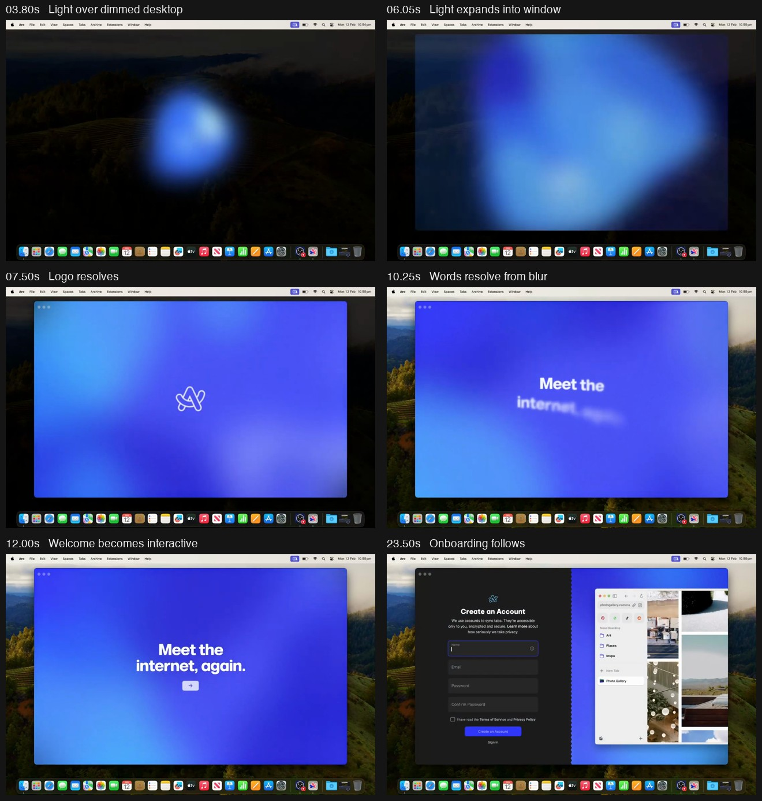
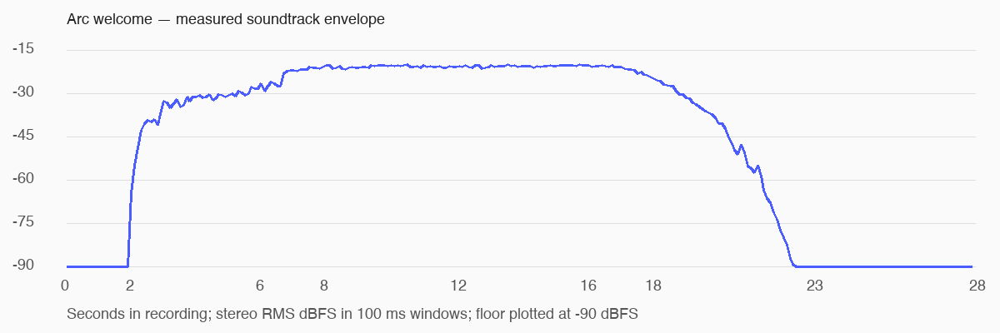

# Arc welcome reference: visual and audio breakdown

Analyzed 2026-09-06 for the ongoing Brigadier design interview. This is an analysis and proposed direction, not an approved implementation plan.

## Source and method

User-supplied file: `/Users/stephen/Downloads/Arc Browser for Mac Welcome Intro (2024).mp4`.

**Measured:** 27.910385 seconds; 1106 × 720 pixels; nominal 29.97 fps; H.264 video with AAC stereo audio at 44.1 kHz. This is a screen recording, not Arc's original animation assets or source code.

**Inspected:** one-second overview samples, quarter-second samples across the opening effects, exact-time frames for the storyboard, and 0.2-second samples around the final transition. Visual event boundaries below are approximate, not original keyframe timings. Decoded stereo audio was measured in 100 ms windows, with one-second checks. No application code was changed or startup performance measured.

**Secondary check:** automated video analysis identified electronic/synth music and the broad scene sequence. Its timings were inaccurate: it extended the logo scene too far, placed the arrow too late, and claimed music continued to the end. The visible frames and decoded waveform override those claims. Exact musical notes, BPM, instrumentation, track identity, and original sound assets are not established.

## Sequence in the supplied recording

| Approximate recording time | Observed behavior | Design significance |
| --- | --- | --- |
| 0–2 s | App is selected from a launch/search interface; desktop returns. | Recording context. This interval is not evidence of an intentional intro delay. |
| 2.5–3.3 s | A small blue light appears near the desktop center and brightens. The wallpaper dims. Menu bar and Dock remain visible. | A single point attracts attention before the application presents controls. |
| 3.3–5.8 s | The light is an irregular, softly bounded volume. Blue dominates; pale cyan highlights travel around it as its contour changes. | The shape has apparent depth and movement, rather than reading as a conventional circular loading spinner. |
| About 5.8–6.3 s | The light rapidly enlarges into a rectangular area. A frame at 6.05 s shows a large soft volume spanning the emerging window; by roughly 6.3 s, the window is filled with color. | The orb and the window appear to share one continuous material. This is the strongest transition in the reference. |
| About 6.5–7.1 s | A small, pale outline Arc logo resolves from blur near the center. The window has rounded corners and subdued traffic-light controls. | Branding arrives after the large movement, when the viewer can focus on a small detail. |
| About 7.1–8.7 s | The logo holds while large blue, cyan and violet color fields drift behind it. The surrounding desktop returns toward its ordinary brightness. | The background remains alive without competing with the mark. |
| About 8.7–9.3 s | The logo dissolves away, leaving a brief interval of color alone. | A deliberate pause separates brand recognition from the message. |
| About 9.5–10.9 s | The two-line headline, “Meet the internet, again.”, emerges progressively from blur. Words resolve at different times with small apparent offsets. | This is a staggered focus transition. Reproducing only an opacity fade would miss the motion character. |
| About 11.2–12 s | A small pale button with a right arrow resolves below the headline. | One next action, with no competing form or explanation. Button presence is visible; the exact moment it becomes clickable is not established. |
| About 12–23.1 s | Headline and arrow remain in place while the colored background keeps moving. | This appears to be a welcome state awaiting continuation. The recording does not establish that this entire dwell is mandatory or prove whether the exit was triggered by mouse, keyboard, or a timer. |
| About 23.1–23.5 s | The welcome gives way to a split account-creation screen: dark form on the left, product imagery over color on the right. | A transition from introduction to a practical next step. Arc's account form is reference content, not a requirement to add accounts to Brigadier. |
| 23.5–27.9 s | Account screen remains visible and its product imagery changes. | These seconds show subsequent onboarding, not additional opening choreography. |

The visually staged portion from the first orb to the complete welcome is approximately 9–10 seconds. The full recording should not be treated as a 28-second blocking splash.

## What gives it its character

1. **A continuous visual material.** The blue orb becomes the window's blue color field. A cut to an unrelated splash screen would break that continuity.
2. **Soft edges with a clear focal point.** The orb has broad bloom and moving highlights. The logo and final text become sharp, giving the viewer somewhere definite to look.
3. **Large-scale, slow background movement.** Several broad color regions overlap. Their appearance is closer to a moving mesh gradient than a flat two-color gradient; the actual rendering technique cannot be inferred from pixels alone.
4. **A limited palette.** Saturated cobalt and violet dominate, with cyan and pale lavender highlights. The green/brown scenery outside the window is the recording's wallpaper, not part of the app's theme.
5. **A hierarchy in time.** Light, window, logo, headline, then action. They do not all enter together. The brief empty interval before the headline matters.
6. **Restrained typography and controls.** A bold, centered two-line headline, a small outline mark, a compact arrow button, and wide empty space. The exact font is not identifiable from this recording alone.
7. **Different motion speeds.** The orb drifts and deforms; expansion is rapid; text resolves at a moderate pace; the final color field keeps moving slowly. One easing curve and duration for every element would flatten the sequence.

This reference establishes animated glow, blur, and color fields. It does not establish a Liquid Glass library, refractive glass rendering, a shader implementation, or native vibrancy.

## Audio: measured structure

- Before about 2 s: effectively silent. Stereo sample magnitude first exceeds −60 dBFS at 2.066 s.
- About 2–7.5 s: gradual build across the orb's emergence, expansion, and logo arrival. One-second stereo RMS rises from approximately −41.1 dBFS at 2–3 s to −21.0 dBFS at 8–9 s.
- About 8–17 s: sustained main level, approximately −21 dBFS in the measured one-second windows. The soundtrack continues while the headline and arrow appear.
- About 17–23 s: a long fade. One-second RMS is approximately −26.6 at 18 s, −43.3 at 20 s, −58.9 at 21 s, and −84.2 dBFS at 22 s. Samples last exceed −60 dBFS at 21.796 s and −90 dBFS at 22.792 s.
- From 23 s to the end: decoded samples are silent. There is no evidence in this recording of an indefinitely looping welcome track.

These are digital levels in the supplied recording, not loudness targets for Brigadier or measurements of the user's speakers. Automated analysis describes an electronic/synth track and a rising swell; that timbral description is not an independently verified musical transcription. The file does not establish whether audio was captured from the app or added by the recorder.

For reproduction, the verified envelope is useful: introduce sound with the light, build into the reveal, sustain through the welcome, then let it decay. A single click sound or a track abruptly cut when loading finishes would have a different effect. Exact audio composition remains a separate design decision.

## Applying this to Brigadier: proposed, not yet confirmed

The user explicitly wants an exceptional first-launch experience closely matching this reference and a related experience with music on later launches. Music must be toggleable in Settings. This supersedes the earlier recommendation of silent subsequent launches.

- Use the reference's ordering, color continuity, changing blur, and musical envelope as the fidelity target. Brigadier's mark, wording, and final destination still need to be selected.
- A close first-launch version would include the orb over the dimmed desktop, its expansion into a window, a brief logo hold, a staggered welcome line, and one continuation action. Whether the effect operates over the desktop is the next interview decision.
- Initialize the application concurrently. Welcome choreography and actual readiness need separate state: elapsed animation is not proof the backend is ready, and an already-ready backend need not erase the first-use welcome.
- Subsequent launches can reuse the same visual and musical motif in a shorter form. Duration, whether it waits for readiness, whether it can finish over the usable interface, and music's default setting remain unconfirmed. A short version should be recomposed, not obtained by accelerating the whole first-launch sequence.
- A failed startup needs a clear recovery state. Sound should fade cleanly on dismissal or leaving the intro. Exact skip, replay, mute, reduced-motion, and interrupted-first-launch behavior will be discussed individually.
- Standard app controls can use shadcn/ui. This cinematic sequence is custom motion/audio work; a component library does not supply it.

## Remaining interview branches

Resolve one at a time: desktop opening effect; brand mark and palette; welcome wording and destination; first-launch pacing and controls; repeat-launch timing relative to real readiness; audio default and Settings control; replay and interruption behavior; visual consistency with the main application. Then return to project-menu actions, organization, right-click behavior and ordering. No final approval or implementation is implied by this analysis.
